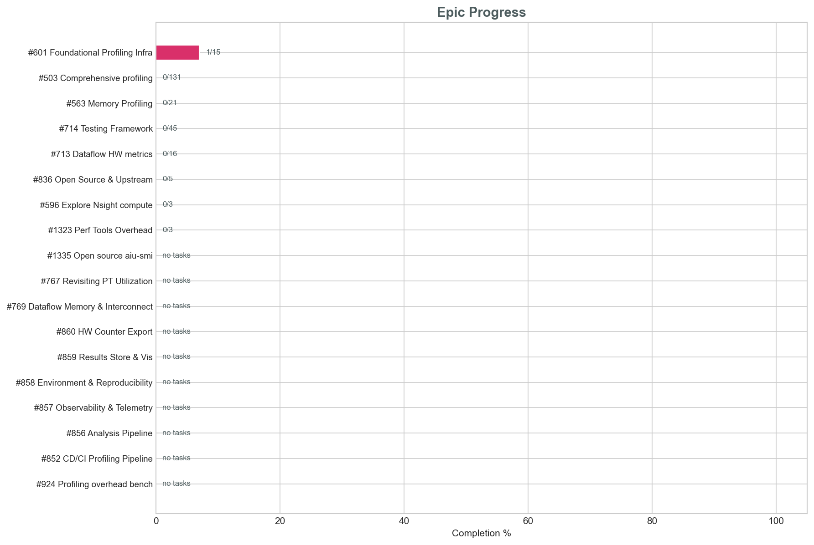
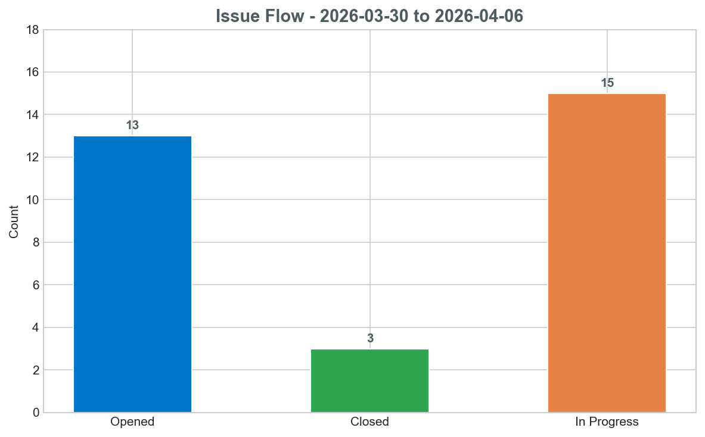
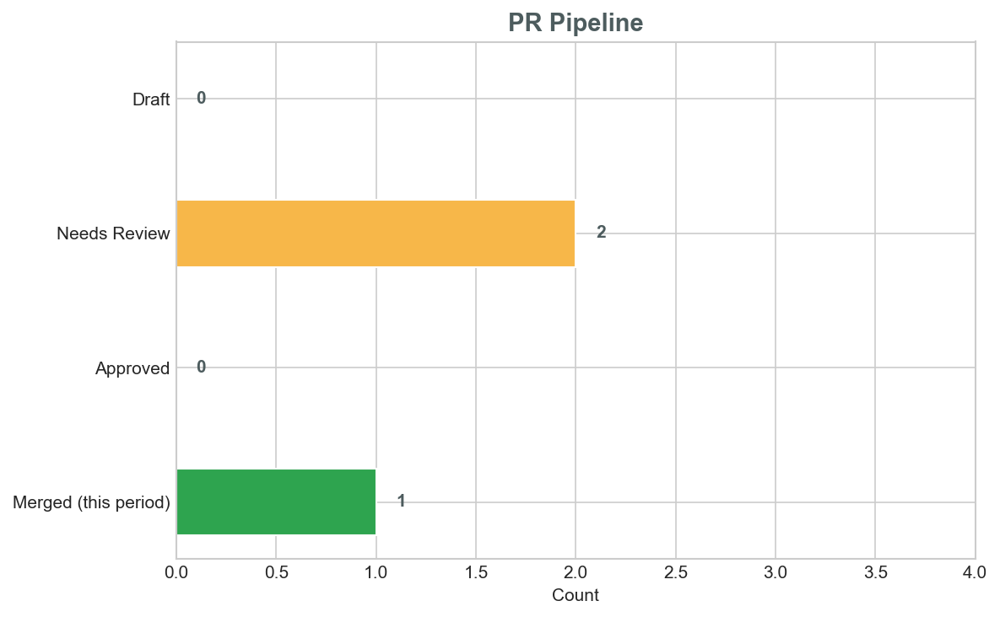
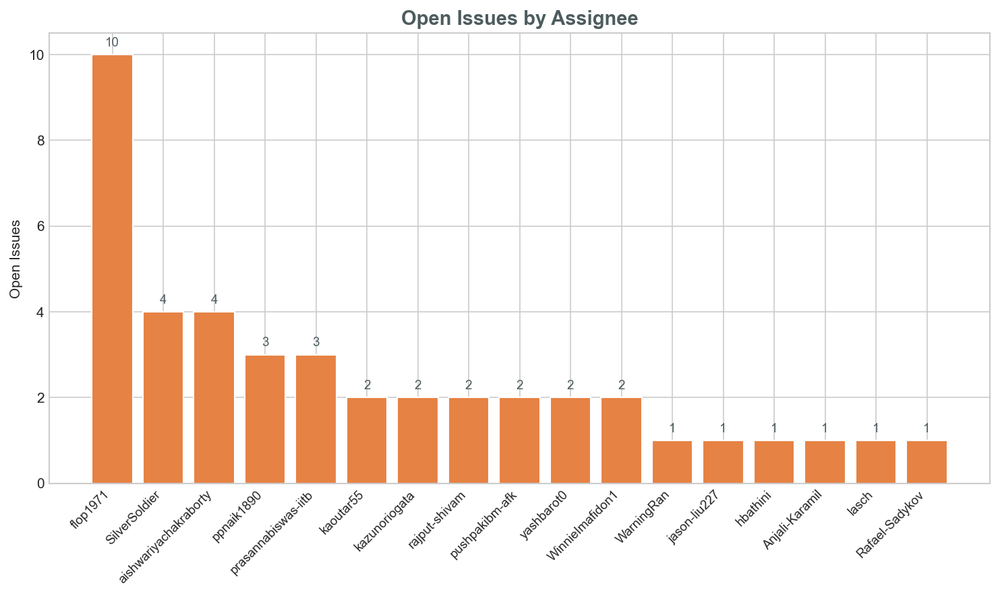
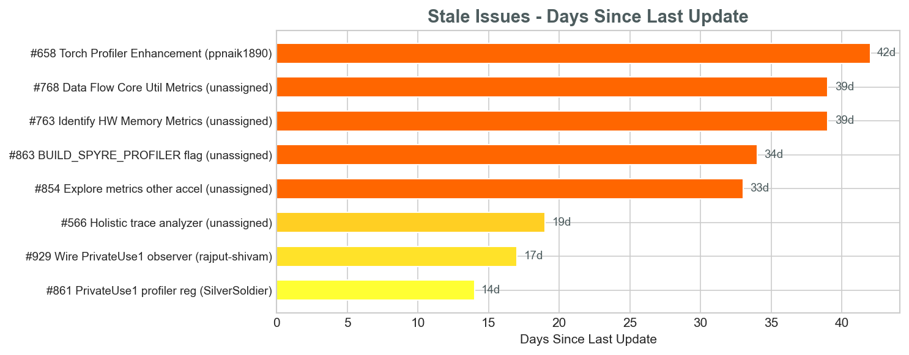

# Profiling Scrum Status — 2026-04-06

**Reporting period:** 2026-03-30 → 2026-04-06

---

# Part 1 — Current Sprint Focus

This section covers what is actively being worked on right now: in-progress
epics, issues with assignees, and PRs under review. Use this section during
the scrum call to discuss status, blockers, and next steps.

## Epics In Progress

Epics that have at least one checked sub-task but are not yet complete.

| Epic | Owner | Progress | Status |
|------|-------|----------|--------|
| [#601](https://github.com/torch-spyre/torch-spyre/issues/601) Foundational Profiling Infrastructure | @kaoutar55, @ppnaik1890, @flop1971 | 1/15 (7%) | 🔴 |

Only one epic has any checked sub-tasks so far. All others are at 0% or have no sub-task checkboxes defined.

---

## Issues In Progress

Open issues that have an assignee and recent activity within the reporting
period. Stale issues (no update in 14+ days) are flagged.

| Issue | Title | Assignee | Last updated | Notes |
|-------|-------|----------|--------------|-------|
| [#1335](https://github.com/torch-spyre/torch-spyre/issues/1335) | Open source aiu-smi | @kazunoriogata | 2026-04-06 | |
| [#1316](https://github.com/torch-spyre/torch-spyre/issues/1316) | VF mode support in aiu-smi | @kazunoriogata | 2026-04-06 | |
| [#1290](https://github.com/torch-spyre/torch-spyre/issues/1290) | Unified profile API in runtime | @lasch | 2026-04-06 | |
| [#846](https://github.com/torch-spyre/torch-spyre/issues/846) | Verify correctness of memory propagated to TB | @prasannabiswas-iitb | 2026-04-03 | |
| [#1324](https://github.com/torch-spyre/torch-spyre/issues/1324) | Document the Unified profile API | @yashbarot0, @WinnieImafidon1 | 2026-04-02 | |
| [#928](https://github.com/torch-spyre/torch-spyre/issues/928) | Integrate with profiling backend registration API in kineto | @SilverSoldier, @prasannabiswas-iitb | 2026-04-01 | |
| [#1166](https://github.com/torch-spyre/torch-spyre/issues/1166) | Expose scratchpad utilization from torch runtime | @aishwariyachakraborty | 2026-04-01 | |
| [#1322](https://github.com/torch-spyre/torch-spyre/issues/1322) | Test integration for torch profiler (integrate with CI/CD) | @prasannabiswas-iitb | 2026-04-01 | |
| [#1317](https://github.com/torch-spyre/torch-spyre/issues/1317) | Test cases for aiu-smi | @hbathini, @Anjali-Karamil | 2026-04-01 | |
| [#931](https://github.com/torch-spyre/torch-spyre/issues/931) | `torch.spyre.synchronize()` runtime API | @pushpakibm-afk | 2026-03-30 | |
| [#930](https://github.com/torch-spyre/torch-spyre/issues/930) | `RecordFunction` hooks in backend dispatch path | @rajput-shivam | 2026-03-30 | |
| [#927](https://github.com/torch-spyre/torch-spyre/issues/927) | Build system: `USE_SPYRE_PROFILER` flag + dual Kineto dependency strategy | @Rafael-Sadykov | 2026-03-31 | |
| [#1167](https://github.com/torch-spyre/torch-spyre/issues/1167) | Nsight metrics spyre mapping | @flop1971, @yashbarot0 | 2026-03-31 | |
| [#851](https://github.com/torch-spyre/torch-spyre/issues/851) | Modify pt utilization for aiu-smi | @WarningRan | 2026-03-25 | ⚠️ stale (12d) |
| [#941](https://github.com/torch-spyre/torch-spyre/issues/941) | Configure profiler to capture memory statistics when enabled | @SilverSoldier | 2026-03-25 | ⚠️ stale (12d) |
| [#1008](https://github.com/torch-spyre/torch-spyre/issues/1008) | Implement pt utilization metric for profiler | @aishwariyachakraborty | 2026-03-25 | ⚠️ stale (12d) |
| [#934](https://github.com/torch-spyre/torch-spyre/issues/934) | Expose per kernel power utilization in acelyzer | @aishwariyachakraborty | 2026-03-25 | ⚠️ stale (12d) |
| [#1053](https://github.com/torch-spyre/torch-spyre/issues/1053) | Test torch spyre and profiling tools | @rajput-shivam, @jason-liu227, @yashbarot0, @Rafael-Sadykov, @pushpakibm-afk | 2026-03-25 | ⚠️ stale (12d) |
| [#861](https://github.com/torch-spyre/torch-spyre/issues/861) | PrivateUse1 profiler activity registration | @SilverSoldier | 2026-03-23 | ⚠️ stale (14d) |
| [#929](https://github.com/torch-spyre/torch-spyre/issues/929) | Wire PrivateUse1 observer via `privateuse1_observer.h` | @rajput-shivam | 2026-03-20 | ⚠️ stale (17d) |
| [#933](https://github.com/torch-spyre/torch-spyre/issues/933) | Test scaffold (`tests/profiler/`) + basic docs | @jason-liu227 | 2026-03-18 | ⚠️ stale (19d) |
| [#932](https://github.com/torch-spyre/torch-spyre/issues/932) | `profile_spyre()` convenience wrapper + `torch_spyre.profiler` package | @pushpakibm-afk | 2026-03-18 | ⚠️ stale (19d) |
| [#745](https://github.com/torch-spyre/torch-spyre/issues/745) | Update profiling documentation | @WinnieImafidon1 | 2026-03-27 | |
| [#864](https://github.com/torch-spyre/torch-spyre/issues/864) | Explore existing testing infra for pytorch profiler | @prasannabiswas-iitb | 2026-03-27 | |
| [#766](https://github.com/torch-spyre/torch-spyre/issues/766) | Expose PyTorch Memory APIs | @SilverSoldier | 2026-03-18 | ⚠️ stale (19d) |
| [#765](https://github.com/torch-spyre/torch-spyre/issues/765) | Enable Memory Profiling in Profiler | @SilverSoldier, @prasannabiswas-iitb | 2026-03-18 | ⚠️ stale (19d) |
| [#658](https://github.com/torch-spyre/torch-spyre/issues/658) | Torch Profiler Enhancement | @ppnaik1890 | 2026-02-23 | ⚠️ stale (42d) |
| [#642](https://github.com/torch-spyre/torch-spyre/issues/642) | Enhancing Provenance Tracking | @ppnaik1890 | 2026-04-01 | |
| [#715](https://github.com/torch-spyre/torch-spyre/issues/715) | FFDC | @kaoutar55 | 2026-04-01 | |
| [#853](https://github.com/torch-spyre/torch-spyre/issues/853) | Initial pytorch memory APIs for Spyre | @SilverSoldier | 2026-03-18 | ⚠️ stale (19d) |

---

## PRs Needing Review

| PR | Title | Author | Waiting since | Reviewers requested |
|----|-------|--------|---------------|---------------------|
| [#770](https://github.com/torch-spyre/torch-spyre/pull/770) | Add Pytorch Memory APIs | @SilverSoldier | 2026-02-26 | @dgrove-oss, @JRosenkranz, @tardieu, @avery-blanchard, @ani300, @thoangtrvn, @tehbone, @kaoutar55 + others — ⚠️ **39 days waiting, has CHANGES_REQUESTED** |
| [#942](https://github.com/torch-spyre/torch-spyre/pull/942) | [profiler][docs] Add profiling contributor guide | @kaoutar55 | 2026-03-09 | @ani300, @dgrove-oss, @JRosenkranz, @tardieu, @avery-blanchard — ⚠️ **28 days waiting, has CHANGES_REQUESTED** |

---

## Draft PRs

No profiling-specific draft PRs currently open.

---

## Blockers & Risks

- **[#770](https://github.com/torch-spyre/torch-spyre/pull/770) Memory APIs PR stuck in review** — open since Feb 26, active design debate about `torch.accelerator.memory` vs custom wrappers. Needs alignment on eager allocator init approach.
- **[#942](https://github.com/torch-spyre/torch-spyre/pull/942) Profiling contributor guide** — has CHANGES_REQUESTED from @flop1971, waiting 28 days. Blocking documentation deliverable.
- **10 stale issues** with assignees that haven't been updated in 12-42 days. Notably:
  - [#658](https://github.com/torch-spyre/torch-spyre/issues/658) Torch Profiler Enhancement (42 days stale)
  - [#766](https://github.com/torch-spyre/torch-spyre/issues/766), [#765](https://github.com/torch-spyre/torch-spyre/issues/765), [#853](https://github.com/torch-spyre/torch-spyre/issues/853) Memory-related issues (19 days stale) — likely blocked on PR #770
  - [#929](https://github.com/torch-spyre/torch-spyre/issues/929) Wire PrivateUse1 observer (17 days stale)
  - [#932](https://github.com/torch-spyre/torch-spyre/issues/932), [#933](https://github.com/torch-spyre/torch-spyre/issues/933) Profiler package scaffold/tests (19 days stale)
- **17 of 18 epics at 0%** — many epics have no sub-task checkboxes defined, making progress hard to track.
- **Several unassigned issues** created this period: [#1321](https://github.com/torch-spyre/torch-spyre/issues/1321), [#1320](https://github.com/torch-spyre/torch-spyre/issues/1320), [#1296](https://github.com/torch-spyre/torch-spyre/issues/1296), [#1295](https://github.com/torch-spyre/torch-spyre/issues/1295), [#1271](https://github.com/torch-spyre/torch-spyre/issues/1271)

---

# Part 2 — Overall Status

Full picture of the profiling workstream for the reporting period: everything
opened, closed, merged, and workload distribution.

## Key Numbers

- **Open issues:** 56
- **Closed this period:** 3
- **Open PRs (profiling):** 2
- **PRs needing review:** 2
- **PRs merged this period:** 1

---

## All Epics

Complete list of profiling epics (including those not yet started).

| Epic | Owner | Progress | Status |
|------|-------|----------|--------|
| [#601](https://github.com/torch-spyre/torch-spyre/issues/601) Foundational Profiling Infrastructure | @kaoutar55, @ppnaik1890, @flop1971 | 1/15 (7%) | 🔴 |
| [#503](https://github.com/torch-spyre/torch-spyre/issues/503) Comprehensive profiling for torch-spyre | @kaoutar55, @ppnaik1890 | 0/131 (0%) | 🔴 |
| [#563](https://github.com/torch-spyre/torch-spyre/issues/563) Memory Profiling in torch-spyre stack | @ppnaik1890 | 0/21 (0%) | 🔴 |
| [#714](https://github.com/torch-spyre/torch-spyre/issues/714) Testing Framework for Profiling | unassigned | 0/45 (0%) | 🔴 |
| [#713](https://github.com/torch-spyre/torch-spyre/issues/713) Dataflow Hardware metrics | unassigned | 0/16 (0%) | 🔴 |
| [#596](https://github.com/torch-spyre/torch-spyre/issues/596) Explore Nsight compute | @flop1971 | 0/3 (0%) | 🔴 |
| [#836](https://github.com/torch-spyre/torch-spyre/issues/836) Open Source and Upstream Contribution | unassigned | 0/5 (0%) | 🔴 |
| [#1323](https://github.com/torch-spyre/torch-spyre/issues/1323) Performace Tools Overhead Analysis | unassigned | 0/3 (0%) | 🔴 |
| [#1335](https://github.com/torch-spyre/torch-spyre/issues/1335) Open source aiu-smi | @kazunoriogata | 0/0 (no tasks) | 🔴 |
| [#767](https://github.com/torch-spyre/torch-spyre/issues/767) Revisiting PT Utilization Metric | unassigned | 0/0 (no tasks) | 🔴 |
| [#769](https://github.com/torch-spyre/torch-spyre/issues/769) Dataflow Memory & Interconnect Metrics | unassigned | 0/0 (no tasks) | 🔴 |
| [#860](https://github.com/torch-spyre/torch-spyre/issues/860) HW Counter Export & Common Event Format | @flop1971 | 0/0 (no tasks) | 🔴 |
| [#859](https://github.com/torch-spyre/torch-spyre/issues/859) Results Store & Visualisation | @flop1971 | 0/0 (no tasks) | 🔴 |
| [#858](https://github.com/torch-spyre/torch-spyre/issues/858) Environment & Reproducibility | @flop1971 | 0/0 (no tasks) | 🔴 |
| [#857](https://github.com/torch-spyre/torch-spyre/issues/857) Observability & Telemetry | @flop1971 | 0/0 (no tasks) | 🔴 |
| [#856](https://github.com/torch-spyre/torch-spyre/issues/856) Analysis Pipeline & Bottleneck Identification | @flop1971 | 0/0 (no tasks) | 🔴 |
| [#852](https://github.com/torch-spyre/torch-spyre/issues/852) CD/CI Profiling Pipeline | @flop1971 | 0/0 (no tasks) | 🔴 |
| [#924](https://github.com/torch-spyre/torch-spyre/issues/924) Profiling overhead benchmarking | unassigned | 0/0 (no tasks) | 🔴 |

---

## Issues Closed This Period

| Issue | Title | Closed by | Date |
|-------|-------|-----------|------|
| [#1214](https://github.com/torch-spyre/torch-spyre/issues/1214) | Enable dumping of ideal cycles and kernel categorization in backend compiler | @raveeshgarg | 2026-04-01 |
| [#926](https://github.com/torch-spyre/torch-spyre/issues/926) | Create `torch_spyre/profiler/` Python package + `csrc/profiler/` C++ directory scaffold | @jason-liu227 | 2026-03-31 |
| [#762](https://github.com/torch-spyre/torch-spyre/issues/762) | aiu-monitor add memory stats | @aishwariyachakraborty | 2026-03-31 |

---

## Issues Opened This Period

| Issue | Title | Opened by | Date |
|-------|-------|-----------|------|
| [#1335](https://github.com/torch-spyre/torch-spyre/issues/1335) | Open source aiu-smi | — | 2026-04-02 |
| [#1324](https://github.com/torch-spyre/torch-spyre/issues/1324) | Document the Unified profile API | — | 2026-04-01 |
| [#1323](https://github.com/torch-spyre/torch-spyre/issues/1323) | Performace Tools Overhead Analysis | — | 2026-04-01 |
| [#1322](https://github.com/torch-spyre/torch-spyre/issues/1322) | Test integration for torch profiler (integrate with CI/CD) | — | 2026-04-01 |
| [#1321](https://github.com/torch-spyre/torch-spyre/issues/1321) | aiu-smi test integration in CI | — | 2026-04-01 |
| [#1320](https://github.com/torch-spyre/torch-spyre/issues/1320) | CI/CD integration for aiu-smi and libaiupti | — | 2026-04-01 |
| [#1317](https://github.com/torch-spyre/torch-spyre/issues/1317) | Test cases for aiu-smi | — | 2026-04-01 |
| [#1316](https://github.com/torch-spyre/torch-spyre/issues/1316) | VF mode support in aiu-smi | — | 2026-04-01 |
| [#1296](https://github.com/torch-spyre/torch-spyre/issues/1296) | Leverage trace-analyzer for perf tests in CI/CD | — | 2026-03-31 |
| [#1295](https://github.com/torch-spyre/torch-spyre/issues/1295) | Enabling trace analyzer for the stack | — | 2026-03-31 |
| [#1290](https://github.com/torch-spyre/torch-spyre/issues/1290) | Unified profile API in runtime | — | 2026-03-31 |
| [#1271](https://github.com/torch-spyre/torch-spyre/issues/1271) | Add support for torch.accelerator.memory.\<API\> | — | 2026-03-30 |
| [#1270](https://github.com/torch-spyre/torch-spyre/issues/1270) | Explore Intra Kernel Profiler for CUDA | — | 2026-03-30 |

---

## PRs Merged This Period

| PR | Title | Author | Merged |
|----|-------|--------|--------|
| [#1147](https://github.com/torch-spyre/torch-spyre/pull/1147) | Profiler directory scaffold | @jason-liu227 | 2026-03-31 |

---

## Visualizations

### Issue Flow

### PR Pipeline

### Workload Distribution

### Stale Issues

